# Art-of-WebGL-Website
Live Link = [https://lnkd.in/dUWVzAHA](https://art-of-web-gl-website.vercel.app/)

Art-of-WebGL-Website is a static WebGL gallery that collects shader-driven visual sessions into a direct, browsable archive. The project is organized as independent rendering experiments: each numbered folder contains its own HTML entry point, generated JavaScript bundle, image assets, and session-specific scene code.

This version is maintained as a branded presentation by Yunus Emre Gürlek / SoftBridge Solutions. It keeps the original session imagery and static delivery model while adding a more polished project identity and GitHub Pages friendly structure.

## Project Purpose

The goal is to present a compact archive of real-time WebGL studies that can run without a backend, build server, database, or application framework. Each session focuses on a different visual system: procedural geometry, particle-like dust layers, post-processing passes, reaction-diffusion simulations, terrain forms, matcap lighting, orbit camera control, framebuffer feedback, and GLSL-based surface treatment.

The repository is useful as a technical reference for browser graphics experiments because the code is split into small rendering units instead of being hidden behind a large engine abstraction. A session can be opened directly in the browser, inspected as plain JavaScript and GLSL, rebuilt with Browserify when needed, or used as a study case for shader composition and frame-loop architecture.

## Technical Details

- Rendering is browser-native WebGL, mostly driven through `regl`, which keeps draw calls declarative while still exposing low-level GPU concepts such as attributes, uniforms, framebuffer targets, textures, and command composition.
- Session bundles are prebuilt as `bundle.js` files, so the gallery can be served as static files from GitHub Pages or any ordinary HTTP server.
- Source modules use CommonJS and Browserify-era composition. The build path in `bin/build.js` wires Browserify, `glslify`, `babelify`, `bundle-collapser`, and `uglify-es`.
- Shader code is composed through `glslify`, allowing reusable GLSL snippets from `common/glsl` and installed shader packages to be imported into JavaScript-driven render commands.
- Geometry generation is handled through small focused utilities such as primitive mesh builders, custom branch/mold/figure mesh generators, catmull-clark helpers, and typed arrays passed into WebGL buffers.
- Several sessions use multipass rendering. The `post-process` folders contain framebuffer-oriented blur/output passes, while reaction-diffusion sessions keep separate compute and draw stages.
- Static visual assets live beside each session and under `common/textures`, keeping runtime fetching simple and making the deployed artifact fully file-based.
- There is no runtime server logic. The only server requirement during development is an HTTP file server so browser security rules can load scripts, textures, and relative assets consistently.
- The visual layer is intentionally session-local. Shared helpers live in `common`, but each numbered folder keeps its own scene orchestration, object setup, simulation state, and draw loop.

## Session Gallery

[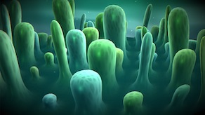](./024/)
[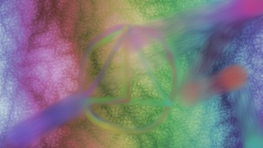](./023/)
[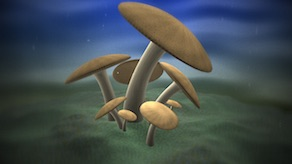](./022/)

[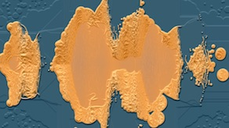](./020/)
[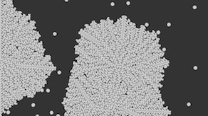](./019/)
[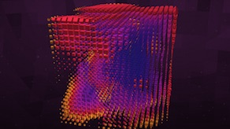](./018/)
[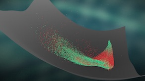](./017/)
[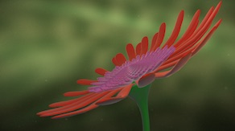](./016/)
[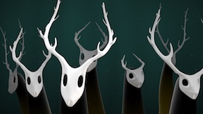](./015/)

[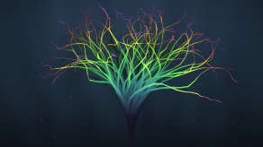](./012/)
[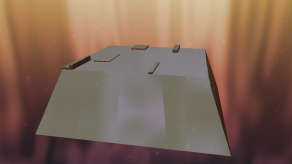](./011/)

[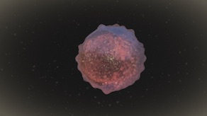](./009/)
[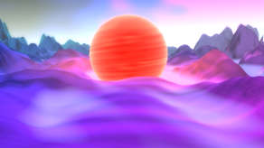](./008/)
[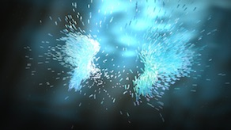](./007/)
[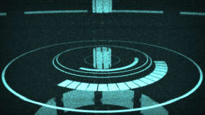](./006/)
[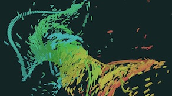](./005/)
[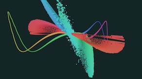](./004/)
[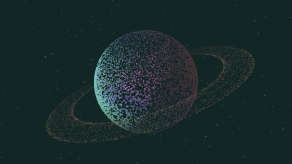](./003/)
[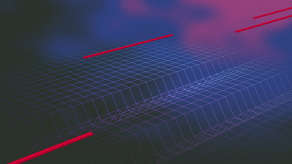](./002/)
[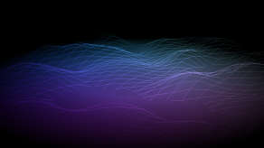](./001/)

## Attribution And License

This repository is a branded adaptation of the original `gregtatum/sessions` WebGL session archive. Source code is distributed under the MIT license, and the original art/design materials are distributed under Creative Commons Attribution-NonCommercial 4.0 as described in `LICENSE`.

Adaptation, project packaging, repository presentation, and SoftBridge Solutions branding by Yunus Emre Gürlek.
